# AS Watson SQL Academy


## Table of Contents


[1 Getting Started](#1-getting-started)
- [1.1 Oracle SQL](#11-oracle-sql) 
- [1.2 Downloading SQL](#12-downloading-sql)
- [1.3 Opening and Saving a File](#13-opening-and-saving-a-file)
- [1.4 SQL Language & Database Concepts](#14-sql-language--database-concepts)
- [1.5 Setting Up Connections](#15-setting-up-connections)

[2 Using the Database](#2-using-the-database)
- [2.1 AS Watson Data Model (ADM) Structure & Data Tables](#21-as-watson-data-model-adm-structure--data-tables)
- [2.2 Business Units](#22-business-units)
- [2.3 AS Watson Calendar](#23-as-watson-calendar)
- [2.4 Currency](#24-currency)

[3 SQL Basics](#3-sql-basics)
- [3.1 Basic SQL Querying Concepts](#31-basic-sql-querying-concepts)
    - [3.1.1 Select Statements](#311-select-statements)
    - [3.1.2 Where, And & Setting Conditions](#312-where-and--setting-conditions)
    - [3.1.3 Aggregate Functions](#313-aggregate-functions)
    - [3.1.4 Like Clause](#314-like-clause)
    - [3.1.5 Distinct Clause](#315-distinct-clause)
    - [3.1.6 Joining Tables](#315-joining-tables)
    - [3.1.7 Case When](#317-case-when)
- [3.2 B_TRANSACTION Table](#32-b_transaction-table)
- [3.3 Main KPIs](#33-main-kpis)
- [3.4 Time Periods](#34-main-time-periods)
- [3.5 Examples](#35-examples)
- [3.6 B_PRODUCT Table](#36-b_product-table)
- [3.7 Transactional Base Table](#37-transactional-base-table)
- [3.8 Final Note](#38-final-note)

[4 Exercises](#4-exercises)
- [4.1 Warm Up Questions - B_TRANSACTION only](#41-warm-up-questions---b_transaction-only)
- [4.2 Exercises 1 - B_TRANSACTION](#42-exercises-1---b_transaction)
- [4.3 Exercises 2 - B_STORE and B_TIME tables](#43-exercises-2---b_store-and-b_time-tables)
- [4.4 Exercises 3 - B_CONTACT and More Complex Queries](#44-exercises-3---b_contact-b_member-and-more-complex-queries)
- [4.5 Exercises 4 - Segmentation Tables and More on Tables](#45-exercises-4---segmentation-tables-and-more-on-tables)
- [4.6 Exercises 5 - Age Calculations](#46-exercises-5---age-calculations)

[5 Answers](#answers)
- [5.1 Warm Up Questions](#51-warm-up-questions-answers)
- [5.2 Exercises 1](#52-exercises-1-answers)
- [5.3 Exercises 2](#53-exercises-2-answers)
- [5.4 Exercises 3](#54-exercises-3-answers)
- [5.5 Exercises 4](#55-exercises-4-answers)
- [5.6 Exercises 5](#56-exercises-5-answers)

[6 Common Errors and Solutions](#6-common-errors-and-solutions)
- [6.1 No Tablespace Error](#61-no-tablespace-error)
- [6.2 No Temp Space Error](#62-no-temp-space-error)
- [6.3 Group by Errors](#63-group-by-errors)
- [6.4 Expected String Got Date](#64-expected-string-got-date)
- [6.5 Table Does Not Exist](#65-table-does-not-exist)
- [6.6 Invalid Identifiers](#66-invalid-identifierscolumn-ambiguously-defined)
- [6.7 Invalid Number](#67-invalid-number)
- [6.8 Running in Same Windows](#68-running-in-same-windows)
- [6.9 Invalid Syntax](#69-invalid-syntax)
- [6.10 Missing Right Parenthesis](#610-missing-right-parenthesis)

## 1 Getting Started 
[Back to Top](#sql-academy)

### 1.1 Oracle SQL
- We use Oracle SQL
- There are other versions, including SQL Server, PostgreSQL, MySQL, SQLite etc. but we do not use these.
- There are minor differences, but you may find that a solution you find online might use a function that is in SQL Server but not Oracle SQL or visa versa.
- When using Google to find an answer (Stack Overflow is your best friend), make sure to add Oracle SQL to get the relevant result.
- Note that Databricks for the EDP environment uses Spark SQL which has some different syntax to Oracle SQL, but this is something that you might use later into your time at AS Watson. 

### 1.2 Downloading SQL
- <u>[SQL Developer](https://aswatsonuk.sharepoint.com/sites/ASWGD/Shared%20Documents/Forms/AllItems.aspx?csf=1&web=1&e=6f1lwM&OR=Teams%2DHL&CT=1666772057858&clickparams=eyJBcHBOYW1lIjoiVGVhbXMtRGVza3RvcCIsIkFwcFZlcnNpb24iOiIyNy8yMjA5MDQwMDcxMiIsIkhhc0ZlZGVyYXRlZFVzZXIiOmZhbHNlfQ%3D%3D&cid=ff58d4e3%2Dc07a%2D4c8a%2D8d81%2Df7b71ac83e11&FolderCTID=0x012000372904FE328ED84D95719C40897751FE&id=%2Fsites%2FASWGD%2FShared%20Documents%2F1%2E%20Analytics%2F02%2E%20Data%20Management%2F00%2E%20General%2FTools&viewid=bd31f600%2D1e1a%2D4ba8%2Db27b%2Dc105f08eec46)</u>
- Unzip the folder ‘sqldeveloper-18.2.0.183.1748-x64’ to your C drive ‘C:\Users\{Username}’
- Pin to task bar so that you can find it easily

### 1.3 Opening and Saving a File
- To open a file drag it into a SQL window that isn’t running any code. (if new window, need to open a connection first)
- To open a blank file, open a new connection and then save it as a new file
- To save an untitled file either press “Ctrl + S” or select “File” then “Save As” and save the file in the follow path: 

    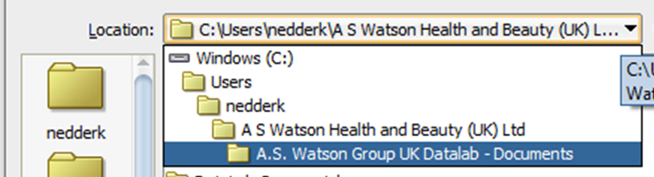

### 1.4 SQL Language & Database Concepts

- SQL = Structured Query Language 
- Originally designed for creating and manipulating data stored in a relational database 
- We use 3 data bases: 
    - CRMBMAP – known as MRD Instance
    - CRMBKVP – known as KV Instance
    - CRMBSDP – Known as SD Instance
- Schemas are collections of database objects, namely tables, but also procedures, packages etc. 
- For example, if you want to look at ICI Paris Netherlands data, this can only be accessed in the CRMBKVP schema (Check Business Units excel for which schema to use)
- CRM_TARGET schema holds all transactional and member data 
- You will probably get your own schema, which is debatably quite exciting.

### 1.5 Setting Up Connections
- Connecting to the database under a new schema: 
    1. Select “View” and then “Connections”. Under Connections, press the Plus button
    2. Name the connection, enter the username and password. Copy and use the same hostname and port. 
    3. Change the Service Name to reflect which instance you would like to connect to. 
    4. Select “Test” and is the connection was successful, then press “Save”
- Note you will have to repeat this 
   for each instance 

    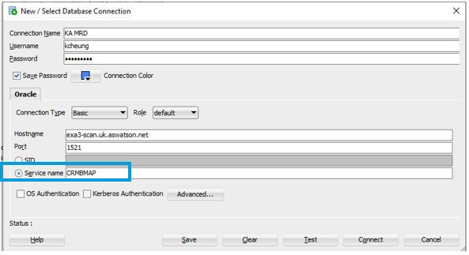


# 2 Using the Database
[<u>Back to Top</u>](#sql-academy)

### 2.1 AS Watson Data Model (ADM) Structure & Data Tables
- <u>[ASW ADM Data Model](https://aswatsonuk.sharepoint.com/:x:/r/sites/ASWGD/_layouts/15/Doc.aspx?sourcedoc=%7B3AD22FDD-FD8B-41CE-B887-2342F8124305%7D&file=EU%20ADM%20Data%20Model%20%26%20More.xlsx&action=default&mobileredirect=true&wdLOR=c0C157FCF-63DE-4B0F-B7BB-9A66FE1E1577)</u>
- Shows the link between the main tables in ADM and all the rules for each BU
    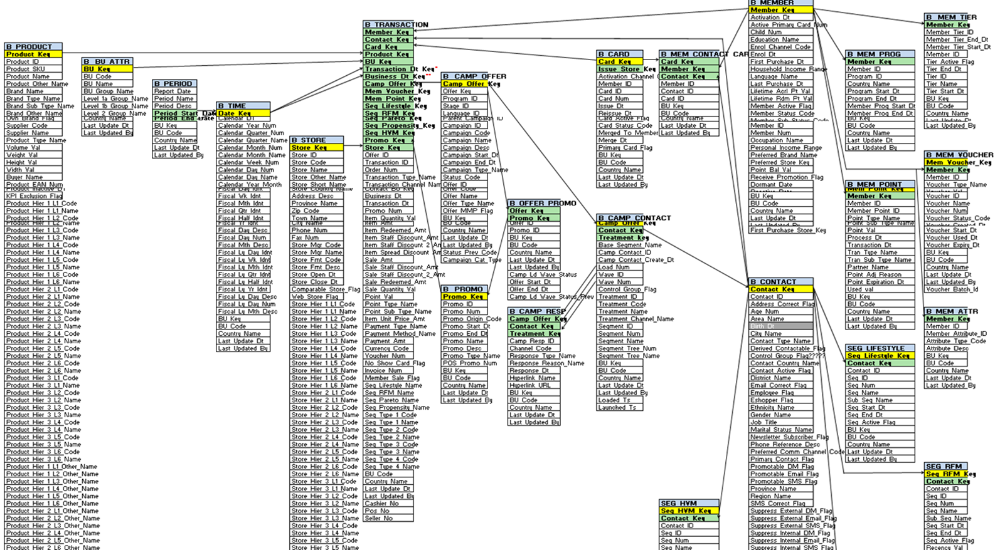

### 2.2 Business Units
- <u>[Business Units](https://aswatsonuk.sharepoint.com/:x:/r/sites/ASWGD/_layouts/15/Doc.aspx?sourcedoc=%7B29874E8B-EB31-4477-897E-F2AE3FBAD053%7D&file=Business%20Units.xlsx&action=default&mobileredirect=true)</u>
- Each BU has a different bu_key and bu_code so that we can easily distinguish between them in the data tables
- We often refer to MCE – Marionnaud Central Europe as: MHU, MRO, MCZ and MSK 
- On the second column you can see which instance you need to have selected in order to access that BU's data
    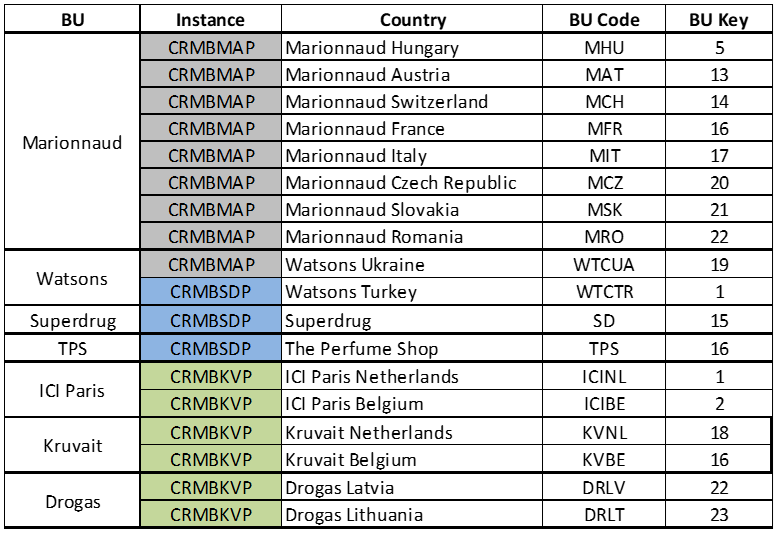


### 2.3 AS Watson Calendar
- <u>[Calendar](https://aswatsonuk.sharepoint.com/:x:/r/sites/ASWGD/_layouts/15/Doc.aspx?sourcedoc=%7B43BB6B4B-FE9C-473D-867C-F9C19EEEB24F%7D&file=Calendrier%202010%20-%202023%20AS%20WATSON.xls&action=default&mobileredirect=true)</u>
- We follow a financial/fiscal calendar which shifts the first day of every month to be a Monday.
- 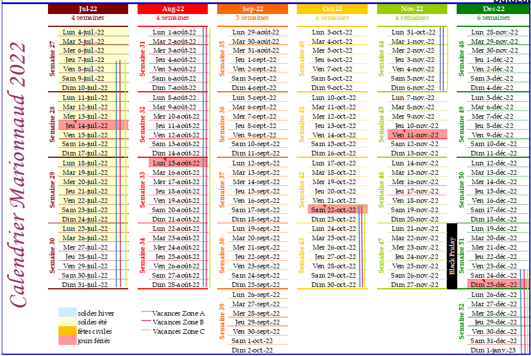


### 2.4 Currency
- Sales in the database are all in local currencies
- When we group together more than one BU we will need to convert the currency to a common one. 
- Most commonly either converted to EUR (€) or HKD  
    


# 3 SQL Basics

[Back to Top](#table-of-contents)

### 3.1 Basic SQL Querying Concepts

### 3.1.1 Select Statements
- Two basic ‘clauses’ for querying data from a table:
    1. tell it what you want ```select```
    2. tell it where to get it from ```from```
- Selecting everything in a specified table:
    ```
    select *
    from table_name
    ```
- Run code using CTRL + Enter or highlight and click  in the top left
- Every query should have a ```;``` at the end
- If we wanted to select just one column:
    ```
    select column_name
    from table_name;
    ```
- You can name a column using ```as```
    ```
    select column_name as new_name
    from table_name;
    ```

### 3.1.2 Where, And & Setting Conditions
- If we want to filter a table to enter select certain features we use a where clause.
- Filter only female members e.g.:
    ```
    select * 
    from table_name
    where gender = ‘F’;
    ```
- An ```and``` clause will be used if we are using more than one filter/exclusion.
- Example: filter by female and older than 25 years
    ```
    select *
    from table_name
    where gender = ‘F’
    and age > 25;
    ```


### 3.1.3 Aggregate Functions
- We use built in functions to aggregate data 
- Has to be used whenever an aggregate function has been used 
- `group by` – e.g. if we wanted sales by date:
    ```
    select transaction_dt_key, sum(sale_amt)
    from crm_target.b_transaction
    group by transaction_dt_key ; 
    ```
- Wide range of aggregate and analytical functions which can be used: 

    - `sum()` – sums the values on selected column 
    - `count()` – counts the # of values returned on selected column 
    - `count(distinct )` – counts the # of unique valued returned on selected column 
    - `min()` – returns the smallest value on selected column 
    - `max()` – returns the largest value on selected column 
    - `avg()` – returns the mean average of values on selected column


### 3.1.4 Like Clause
- When it is unknown what the correct format of a variable is in one of the tables (as they might differ BU to BU – e.g. brand names in the b_product table), we can use like function to help us out. 
- Note that this is typically quite inefficient, so avoid if possible.
- It is case sensitive so usually we use `upper(brand_name) like ‘%CLINIQUE%’` which converts the brand_name value to uppercase
- It is used in the where clause and is used like: 
    ```
    select brand_name
    from crm_target.b_product 
    where bu_key = 13
    and brand_name like ‘%CLINIQUE%’
    group by brand_name ;
    ```

### 3.1.5 Distinct Clause
- In order to get unique values from an output, use the distinct keyword.
- Used after the `select`, this will only return unique rows.

- E.g. `select distinct contact_key from table_name`
    - Returns only unique contact keys
    - This can be used in conjunction with a counting argument to count unique shoppers
        - E.g. `select count(distinct contact_key) from table_name`


### 3.1.6 Joining Tables
- You can join tables together to get more data 
- Documentation: https://www.w3schools.com/sql/sql_join.asp
- There are a few types of joins but the terminology for joining the tables is the same
- Note that `join` is the same as `inner join`, but `inner join` was used in older versions of SQL.
 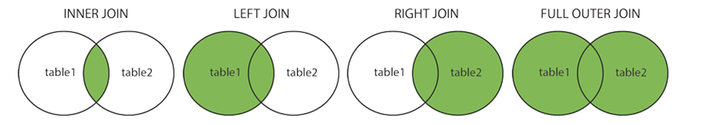
- You will mostly use `join` and `left join`, but the others can occasionally be handy.
- Something to note:
    - You might see some very old code using (+), but Oracle does not recommend using this anymore.

    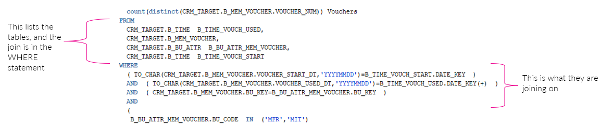
- Duplicate columns
    -   ```
        select 
            a.contact_key
        ,	b.contact_key
        from crm_target.b_transaction a
        join crm_target.b_contact b on a.contact_key = b.contact_key
        ```
    - If each table contains the same column name, you will need to specify which column from each table to join on
    - Give each table an alias here we use `a` and `b`
    - Another example:
        ```
        select 
            p.product_name
        ,	sum(t.item_amt) as sales
        from crm_target.b_transaction t 
        inner join crm_target.b_product p on p.product_key = t.product_key
         where t.bu_key = 17 
        and t.transaction_dt_key between 20220101 and 20220120
        and member_sale_flag = ‘Y’
        group by p.product_name;
        ```
        
    

### 3.1.7 Case When
- If we wanted to create a variable based of a condition (‘IF’ statement for example), we can use `case when`:
    ```
    select 
        case when column_1 = condition_1 then ‘A’
            when column_1 = condition_2 then ‘B’
            else ‘C’ end as letters
    ,	column_2
    from table_name
    group by case when column_1 = condition_1 then ‘A’
            when column_1 = condition_1 then ‘B’
            else ‘C’ end, column_2;
    ```
- Often used for creating age bands

    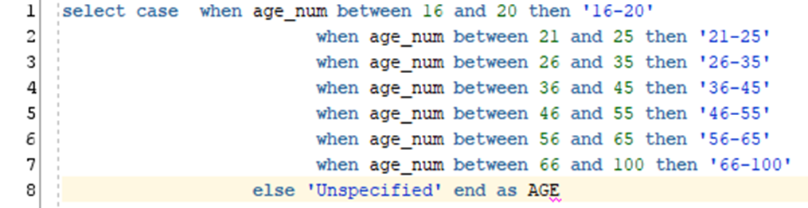


### 3.2 B_TRANSACTION Table
[<u>Back to Top</u>](#sql-academy)

- ```CRM_TARGET.B_TRANSACTION``` 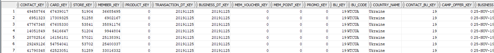
- Contains all transactional data 
- We use ```transaction_dt_key``` (date of transaction) to set which dates we want to see data for
- There are multiple ```transation_type_name``` (header rows) in the ```b_transaction``` table. The most used are:
    - Sale – shows the total sale breakdown for the purchase
    - Item – breaks the purchase down to item level 
    - Promotion – breaks the purchase down into Promotions which were used
    - Point – shows the point breakdown for the purchase (for member transactions)
- `member_key` / `contact_key` are unique numbers used to represent members. 
- A non-member will have a contact key of 0
- `member_sale_flag` can be used to distinguish a member transaction from a non member transaction. 


### 3.3 Main KPIs
[<u>Back to Top</u>](#sql-academy)

- ATV – $\text{average transaction value}=\frac{\text{total sales}}{\text{total transactions}}$

- ATF – $\text{average transaction frequency}=\frac{\text{total transactions}}{\text{no. of members}}$

- ACV – $\text{average customer value}=\frac{\text{total sales}}{\text{no. of members}}$

- IPT – $\text{items per transaction}=\frac{\text{no. of items}}{\text{total transactions}}$

- PPU – $\text{price per unit}=\frac{\text{total sales}}{\text{no. of items}}$

- YoY change – $\text{year on year change} = \frac{\text{this year value}}{\text{last year value}} - 1$ &nbsp; &nbsp; &nbsp; &nbsp; *(multiply by 100 for %)*

- MSP – $\text{member sales participation}=\frac{\text{member sales}}{\text{total sales}}\times 100$

- $\text{6 month active rate}=\frac{\text{no. of members shopped in last 6 months}}{\text{no. of members shopped in last 3 years}}$


### 3.4 Main Time Periods
- YTD – Year to Date – e.g. YTD March 2022 = Jan 2022 to March 2022
- MTD – Month to Date – e.g. first 3 weeks of MTD May 2022 = W18-20 May 2022
- WTD – Week to Date – a given week period- e.g. WTD Week 11 = Week 11 only
- MAT – Moving Annual Total - last 12 months of data – e.g. MAT April 2022 = May 2021 to April 2022 
- LTM – Last 12 Months – same as MAT
- YoY – Year on Year – This Year vs Last Year


### 3.5 Examples
- Total number of members shopping in Marionnaud Austria in January 2022
    ```
    select count(distinct contact_key) 
    from CRM_TARGET.B_TRANSACTION
    where bu_key = 13
    and transaction_dt_key between 20220103 and 20220130
    and member_sale_flag = ‘Y’
    and contact_key > 0
    and transaction_type_name = ‘Item’;
    ```
- Total Sales in MFR, YTD May 2022
    ```
    select sum(item_amt) 
    from CRM_TARGET.B_TRANSACTION
    where bu_key = 16
    and transaction_dt_key between 20220103 and 20220529
    and transaction_type_name = ‘Item’; 
    ```

### 3.6 B_PRODUCT Table
- `CRM_TARGET.B_PRODUCT`
    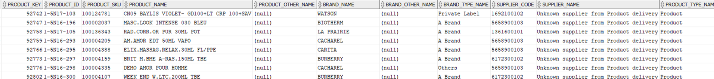
- This table shows the information for every product sold
- We use product hierarchies to determine different categories and sub-categories BUs use (found in EU ADM model Document) 
- When calculation KPIs, we use always use the following exclusion: 
`kpi_exclusion_flag = ‘N’`
- *Used for all BUs – exception for MIT, see ADM data model document* 


### 3.7 Transactional Base Table
- Some of the larger BUs can take longer to run, so we have base tables created to use instead of joining the `b_transaction` and the `b_product` table 
- These are in place for: 
    - ICI – `ACHAN.ICI_NLBE_WTOR`
    - KV – `CRM_TARGET.T_ORDITEM_KV`
    - SD – `CRM_TARGET.T_ORDITEM_SD`
- These tables already include some of the transactional and product exclusions e.g. `transaction_type_name` 
- Use instead of the `b_transaction` table for ICINL,ICIBE,KVNL,KVBE,SD


### 3.8 Recap and Final Note
- Basic Code Structure
    ```
    select 
        column_1
    ,  sum(column_2)
    from table_name
    where condition_1
    and condition_2
    group by column_1;
    ```
- SQL is not case sensitive for syntax but is for record contents.
- It does not have significant whitespace like Python, so you don’t need to worry about indentation, although try to keep things neat.
- Typical best practice is to use all-caps, but this doesn’t matter too much.
- However, if you would like to specify a record, e.g. Estée Lauder, you will need to write it exactly as it is listed in the database, matching the upper and lowercase letters.
- You can always use something like select distinct brand_name and find your desired record to see how it is formatted.

# 4 Exercises

[Back to Top](#table-of-contents)

## 4.1 Warm Up Questions - B_TRANSACTION only
[Answers](#51-warm-up-questions-answers)

1. Return all transactions that happened in MIT on the 1st of January 2023.

2. Return all unique members who shopped MFR on the 1st of January 2023.

3. What were the total Member Sales on the 30th of May 2023 in MAT?

4. How many rows are in the B_TRANSACTION table on the 16th of September 2023 for MHU? Hint: count(*) returns the number of rows.

5. How many items were bought in MCZ on the 25th of March 2023?


## 4.2 Exercises 1 - B_TRANSACTION
[Answers](#52-exercises-1-answers)

1. How many Dolce and Gabbana products are listed in B_PRODUCT which are sold in MCH?

2. For all transactions that occurred in 2023 Week 15 in MCZ, return the following columns: `bu_key, contact_key, transaction_dt_key, order_num, product_sku, product_name, item_amt and item_quantity_val`

3. Return the following KPIs for 2023 week 50 (ATV, ATF, ACV, IPT, PPU) in MSK.

4. Total sales and Member sales in 2023 week 2 in MFR.

5. What was the most popular SKIN CARE product SKU in MHU in 2023 in terms of total sales?

## 4.3 Exercises 2 - B_STORE and B_TIME tables

### B_STORE / WEB_STORES

- `select * from crm_target.b_store;`
- shows information for every store, e.g. `store_name`, `store_code` etc.
- `RCOVELL.WEB_STORES` : The `web_store_flag` is not regularly updated, so we use another table to distinguish online sales, `select * from rcovell.web_stores` to see what is in this table

### B_TIME

- `select * from crm_target.b_time;`
- join to the transaction table use `date_key` from the time table and `transaction_dt_key` from the transaction table
- can be very helpful for finding fiscal week/month/year

### Exercises 2

[Answers](#53-exercises-2-answers)

1. Top 5 stores by Member Sales in MAT for week 20 2023.

2. Member sales KPIs for (ATV, ATF, ACV, IPT, PPU) in MCZ in 2023, by fiscal quarter (Q1-Q4)

3. Top 5 men's fragrance SKUs sold in The Perfume Shop (TPS) within Lyon throughout the December 2023 period.

4. For each week of January 2023, what percentage of members shopped on weekdays and on weekends in MIT?

## 4.4 Exercises 3 - B_CONTACT, B_MEMBER and More Complex Queries

[Answers](#54-exercises-3-answers)

### B_CONTACT

- `select * from crm_target.b_contact`
- contains contact information for members such as age, gender and contactability status

### B_MEMBER

- `select * from crm_target.b_member`
- contains additional member data such as member points, first purchase date and enrol date (these are not necessarily aligned)

### HAVING statement

- similar to the WHERE statement so is not often used
- it's advantage is that it can use grouped functions, where an example can be seen below:

```
select
    contact_key,
    count(distinct order_num) as trxs
from
    crm_target.b_transaction
group by 
    contact_key
having count(distinct order_num) >= 2
;
```

### Nested Queries

- we can use nested queries to write more complex code and improve run time
- for example, selecting contact_keys where they spent more than €1000 over the year in MAT in 2023:

```
select 
    contact_key
from (
    select
        t.contact_key,
        sum(t.item_amt) as sales
    from 
        crm_target.b_transaction t
        join crm_target.b_time d on d.date_key = t.transaction_dt_key
    where
        fiscal_yr_idnt = 2021
        and t.bu_key = 13
        group by t.contact_key
    )
where sales > 1000
;
```

This doesn't have to be a nested query, it could be done with a having statement in one statement for example, but it is a way of introducing the idea. There is often more than one way of finding what you want, the trick is doing it in the most efficient (or logical) fashion.

### Exercises 3

[Answers](#54-exercises-3-answers)

1. How many members shopped 2+ times in January 2023 in MAT?
2. How many male ICINL members who enrolled in 2023 are shopping again in 2024 (up to 202405)?
3. Using the template provided below (or otherwise), and only changing the select statement, calculate the retention rates for both LANCOME and CHANEL from the first half of 2023 to the second half of 2023.
    - note that retention is calculated as:
    $$\text{Retention rate} = \frac{\text{Number of members who returned to shop in the post-period}}{\text{Number of members who shopped in the pre-period}} \times 100$$

```
select 
    *
from 
    (select 
        contact_key,
        brand_name as brand_name_pre_period 
    from CRM_TARGET.B_TRANSACTION t
    join CRM_TARGET.B_PRODUCT p on t.product_key = p.product_key
    join CRM_TARGET.B_TIME tm on t.transaction_dt_key = tm.date_key
    where t.bu_key = 13
    and calendar_year_month between 202301 and 202306
    and contact_key > 0
    and member_sale_flag = 'Y'
    and transaction_type_name = 'Item'
    and kpi_exclusion_flag = 'N'
    and brand_name in ('LANCOME','CHANEL')
    group by
        contact_key
    ,   brand_name) A
left join 
    (select 
        contact_key,
        brand_name as brand_name_post_period 
    from CRM_TARGET.B_TRANSACTION t
    join CRM_TARGET.B_PRODUCT p on t.product_key = p.product_key
    join CRM_TARGET.B_TIME tm on t.transaction_dt_key = tm.date_key
    where t.bu_key = 13
    and calendar_year_month between 202307 and 202312
    and contact_key > 0
    and member_sale_flag = 'Y'
    and transaction_type_name = 'Item'
    and kpi_exclusion_flag = 'N'
    and brand_name in ('LANCOME','CHANEL')
    group by
        contact_key,
        brand_name) B on A.contact_key = B.contact_key
order by A.contact_key
;
```

## 4.5 Exercises 4 - Segmentation tables and more on Tables

### Segmentation Tables

- There are two segment tables: CRM_TARGET.SEG_RFM and CRM_TARGET.SEG_LIFESTYLE
- Each member has an RFM segment and a Lifestyle segment which are determiend by a number of factors, e.g. KPIs, shopping behaviours, key categories and more, and are updated on a monthly basis

### SEG_RFM

> **Note that the RFM tables can break down sometimes, so please make sure to be aware if any are incorrect before doing reporting with them**

- each member has an RFM segment that is refreshed at the beginning of each month
- when reporting on RFM segments we use the most recent RFM a member has. For example, if we were running a report using the period Jan-Jul 2024, we would measure RFM segments as of the 1st of August.
- we use the following code to ensure we only use their most recent segment, and don't end up with duplicates: ```where seg_start_dt <= '01-AUG-24' and (seg_end_dt >= '01-AUG-24' or seg_end_dt is null)```
-  RFM Segment calculations can differ for each BU, but they all have the following segments, in order of loyalty:
    1. VIP
    2. Loyal
    3. Regular
    4. One-Offs
    5. Lapsed
    6. Inactive
    7. Gone-Away
    8. New

### Creating Tables in ADM

We can create tables to store data to be used later with the following code:

``` 
create table new_table_name as
select 
    column_names as new_column_alias
from 
    existing_tables
where 
    {conditions}
;
```
- remember to **drop tables you no longer need** to save space on the schemas with the following code: `drop table {table_name};`
- to remove all data from a table and make it empty, but keep the table: `truncate table {table_name};`

### Inserting into Tables

We can insert into existing tables like so:

```
insert into new_table_name
select 
    column_1_name,
    sum(column_2_name) as column_2_alias
from
    table_name
group by
    column_1_name
;
```
- You can test that your table is going to be correct by omitting the `insert into new_table_name` and just running the `select` part of the query, before fully comitting to making a table
- Your first instinct should not be to create a table, as they take up space on the schema - if you can use a nested query, or any alternative, this should be your go to before creating tables

We can also delete from tables like so: `delete from table_name where {conditions};`.

### Creating Indexes on Tables

We can create an index on a column in a table to improve run time:
```
create index index_name on table_name(indexed_column_name);
```
And drop an index in the same fashion as tables: `drop index indexed_column_name`.

- These take up additional tablespace on the database
- Once a table with an index is dropped, the index will also be automatically dropped too

### Importing/Exporting Tables

**To import a table into ADM:**
1. Expand the connection and right-click tables
2. Select Import data
3. Select csv file
4. Name ADM table
5. Check each column is formatted and named correctly
6. Click Finish

**To export a table to csv:**
1. Right click on the table
2. Select Export
3. Choose file location
4. Click Finish

### Exercises 4

[Answers](#55-exercises-4-answers)

1. How many VIP Members bought Lancôme in MAT in YTD March 2023?
2. What were the sales by week of Regular Female Members shopping in Superdrug in February 2023?
3. What is the current distribution of RFM segments for MCH Members?
4. Find the KPIs (ATV, ATF, ACV, IPT, PPU) for ICIBE Members in April 2023 for Active RFM segments. (Note that in Luxury BUs Active RFM segments are: VIP, Loyal, Regular, One-Off and New)
5. Find the RFM Member Sales Split for MIT in August 2023.


## 4.6 Exercises 5 - Age Calculations

There are a couple different ways of looking at the age of members: Their actual ages, and the generation they are from. The more common way is finding their actual ages, but generations are becoming more popular. For now, we will focus on finding their ages, as the idea is the same for both.

The following code can be used for calculating age bands, which is based off of `birth_dt` to enable historical age data:

```
case when trunc(months_between('DD-MMM-YY', c.birth_dt) / 12) between 16 and 20 then 'Under 20'
when trunc(months_between('DD-MMM-YY', c.birth_dt) / 12) between 21 and 25 then '21-25'
when trunc(months_between('DD-MMM-YY', c.birth_dt) / 12) between 26 and 35 then '26-35'
when trunc(months_between('DD-MMM-YY', c.birth_dt) / 12) between 36 and 45 then '36-45'
when trunc(months_between('DD-MMM-YY', c.birth_dt) / 12) between 46 and 55 then '46-55'
when trunc(months_between('DD-MMM-YY', c.birth_dt) / 12) between 56 and 65 then '56-65'
when trunc(months_between('DD-MMM-YY', c.birth_dt) / 12) between 66 and 100 then '65+'
else 'Unspecified' end as age
```
- note that it will need to be put in both the select and the group by statements

We can also use a column called `age_num` in the contact table which has their current age.

### Exercises 5

[Answers](#56-exercises-5-answers)

1. What is the average age of Marionnaud Hungary members which shopped Clinique in Week 25 2024?
2. What were the total sales for members aged between 36 and 45 for the online TPS store in May 2023?
3. What is the sales growth for all age bands in ICINL in March 2023 vs March 2024 by taking age at time of transaction?
4. What is the member age split of Marionnaud Switzerland members that shopped Shiseido products in October 2023?


# 5 Answers


## 5.1 Warm Up Questions (Answers)
[Back to Questions](#41-warm-up-questions---b_transaction-only)

1.  Code:  
    ```
    select *
    from crm_target.b_transaction
    where bu_key = 17
    and transaction_dt_key = 20230101;
    ```
    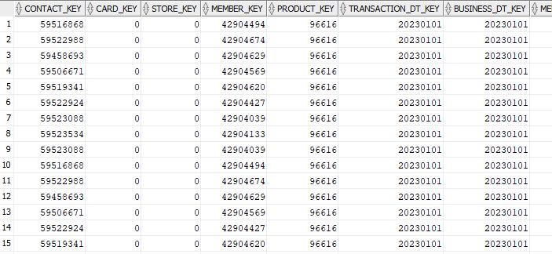 

2.  Code:  
    ```
    select 
        distinct(contact_key)
    from crm_target.b_transaction
    where bu_key = 16
    and transaction_dt_key = 20230101
    and contact_key > 0
    and member_sale_flag = 'Y';
    ```
    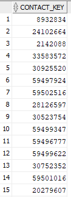 

3.  Code:  
    ```
    select 
        sum(item_amt) as member_sales
    from crm_target.b_transaction
    where bu_key = 13
    and transaction_dt_key = 20230530
    and contact_key > 0
    and member_sale_flag = 'Y';
    ```
    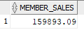 

4. Code:
    ```
    select 
        count(*)
    from crm_target.b_transaction
    where bu_key = 5
    and transaction_dt_key = 20230916;
    ```
    

4. Code:
    ```
    select
        sum(item_quantity_val)
    from crm_target.b_transaction
    where bu_key = 20
    and transaction_dt_key = 20230325;
    ```
    


## 5.2 Exercises 1 (Answers)
[Back to Questions](#42-exercises-1---b_transaction)
1. Code:
    ```
    select 
        count(distinct produt_sku)
    from
        crm_target.b_product
    where
        bu_key = 140
        and brand_name like '%Dolce%'
    ;
    ```
    
2. Code:
    ```
    select
        t.bu_key,
        contact_key,
        transaction_dt_key,
        order_num,
        product_sku,
        product_name,
        item_amt,
        item_quantity_val,
    from
        crm_target.b_transaction t
        join crm_target.b_produt p on t.product_key = p.produt_key
    where
        t.bu_key = 20
        and transaction_dt_key between 20230410 and 20230416
    ;
    ```

3. Code:
    ```
    select
        sum(item_amt) / count(distinct order_num) as ATV,
        count(distinct order_num) / count(distinct contact_key) as ATF,
        sum(item_amt) / count(distinct contact_key) as ACV,
        sum(item_quantity_val) / count(distinct order_num) as IPT,
        sum(item_amt) / sum(item_quantity_val) as PPU
    from
        crm_target.b_transaction t
        join crm_target.b_product p on t.product_key = p.product_key,
    where
        t.bu_key = 21
        and transaction_dt_key between 20231211 and 20231217
        and contact_key > 0 
        and member_sale_flag = 'Y'
        and transaction_type_name = 'Item'
        and kpi_exclusion_flag = 'N'
    ;
    ```

    > Sense-checking KPIs: These can often by checked on a report in WV in the 201 to make sure your numbers seem right

4. There are two ways to go about this query. First, we can use two separate queries for each case, whether a sale is from a member or not:

    ```
    -- total sales
    select
        sum(item_amt) as total_sales
    from
        crm_target.b_transaction t
        join crm_target.b_product p on t.product_key = t.product_key
    where
        t.bu_key = 16
        and transaction_dt_key between 20230109 and 20230115
        and transaction_type_name = 'Item'
        and kpi_exclusion_flag = 'N'
    ;

    -- member_sales
    select
        sum(item_amt) as member_sales
    from
        crm_target.b_transaction t
        join crm_target.b_product p on t.product_key = t.product_key
    where
        t.bu_key = 16
        and transaction_dt_key between 20230109 and 20230115
        and transaction_type_name = 'Item'
        and kpi_exclusion_flag = 'N'
        and member_sale_flag = 'Y'
        and contact_key > 0
    ;
    ```
    However, there is a cleaner and more efficient way of finding the results. You may have noticed the above queries are very similar, just with two slightly different cases in the `where` clause. We can use a `case when` statement to make our lives easier here.

    ```
        select
        sum(item_amt) as total_sales,
        sum( case when contact_key > 0 and member_sale_flag = 'Y' then item_amt end) as member_sales
    from
        crm_target.b_transaction t
        join crm_target.b_product p on t.product_key = t.product_key
    where
        t.bu_key = 16
        and transaction_dt_key between 20230109 and 20230115
        and transaction_type_name = 'Item'
        and kpi_exclusion_flag = 'N'
    ;
    ```

5. Code
    ```
    select
        product_sku,
        brand_name,
        product_name,
        volume_val,
        sum(item_amt) as total_sales
    from    
        crm_target.b_transaction t
        join crm_target.b_product p on t.product_key = p.product_key
    where
        t.bu_key = 5
        and transaction_dt_key between 20230102 and 20231231
        and kpi_exclusion_flag = 'N'
        and product_hier_3_l1_name = 'SKIN CARE'
    group by
        product_sku,
        brand_name,
        product_name,
        volume_val
    order by 
        total_sales desc
    ;
    ```

## 5.3 Exercises 2 (Answers)

[Questions](#43-exercises-2---b_store-and-b_time-tables)

1. Code:
    ```
    select
        t.store_key,
        s.store_name,
        sum(item_amt) as member_sales
    from
        crm_target.b_transaction t 
        join crm_target.b_product p on t.product_key = p.product_key
        join crm_target.b_store s on t.store_key = s.store_key
        join crm_target.b_time d on t.transaction_dt_key = d.date_key
    where
        t.bu_key = 13
        and d.fiscal_wk_idnt = 202220
        and transaction_type_name = 'Item'
        and member_sale_flag = 'Y'
        and contact_key > 0
        and p.kpi_exclusion_flag = 'N'
    group by 
        t.store_key
        s.store_name
    order by 
        member_sales desc
    ;
    ```

2. Code:
    ```
    select
        fiscal_qtr_idnt,
        sum(item_amt) / count(distinct order_num) as ATV,
        count(distinct order_num) / count(distinct contact_key) as ATF,
        sum(item_amt) / count(distinct contact_key) as ACV,
        sum(item_quantity_val) / count(distinct order_num) as IPT,
        sum(item_amt) / sum(item_quantity_val) as PPU
    from
        crm_target.b_transaction t
        join crm_target.b_product p on t.product_key = p.product_key
        join crm_target.b_time d on t.transaction_dt_key = d.date_key
    where
        t.bu_key = 20
        and d.fiscal_yr_idnt = 2021
        and contact_key > 0 
        and member_sale_flag = 'Y'
        and transaction_type_name = 'Item'
        and kpi_exclusion_flag = 'N'
    group by
        fiscal_qtr_idnt
    ;
    ```

3. Code:
    ```
    select
        product_sku,
        product_name,
        sum(item_amt) as fragrance_sales
    from    
        crm_target.b_transaction t
        join crm_target.b_product p on t.product_key = p.product_key
        join crm_target.b_time d on t.transaction_dt_key = d.date_key
        join crm_target.b_store s on t.store_key = s.store_key
    where
        t.bu_key = 16
        and fiscal_mth_idnt in 202312
        and contact_key > 0
        and member_sale_flag = 'Y'
        and transaction_type_name = 'Item'
        and p.kpi_exclusion_flag = 'N'
        and city_name = 'LYON'
        and product_hier_3_l2_name = 'MEN FRAGRANCES'
    group by
        product_sku,
        product_name
    order by 
        fragrance_sales desc
    ;
    ```

    > Here, as we are after the top 5, we can also use the `rank()` function, which can be very handy especially when we start using more complex queries. See below for how you would implement it in this case:

    ```
    select
        product_sku,
        product_name,
        sum(item_amt) as fragrance_sales,
        rank() over(order by sum(item_amt) desc) as fragrance_sales_rank
    from    
        crm_target.b_transaction t
        join crm_target.b_product p on t.product_key = p.product_key
        join crm_target.b_time d on t.transaction_dt_key = d.date_key
        join crm_target.b_store s on t.store_key = s.store_key
    where
        t.bu_key = 16
        and fiscal_mth_idnt in 202312
        and contact_key > 0
        and member_sale_flag = 'Y'
        and transaction_type_name = 'Item'
        and p.kpi_exclusion_flag = 'N'
        and city_name = 'LYON'
        and product_hier_3_l2_name = 'MEN FRAGRANCES'
    group by
        product_sku,
        product_name
    ;
    ```

4. Code:
    ```
    select
        fiscal_wk_idnt,
        count(distinct case when (fiscal_day_num bewteen 1 and 5) then contact_key end) / count(distinct contact_key) as weekday_pct,
        count(distinct case when (fiscal_day_num between 6 and 7) then contact_key end) / count(distinct contact_key) as weekend_pct
    from
        crm_target.b_transaction t
        join crm_target.b_product p on t.product_key = p.product_key
        join crm_target.b_time d on t.transaction_dt_key = d.date_key
    where
        t.bu_key = 17
        and fiscal_mth_idnt = 202201
        and contact_key > 0
        and member_sale_flag = 'Y'
        and transaction_type_name = 'Item'
        and kpi_exclusion_flag = 'N'
    group by 
        fiscal_wk_idnt
    ;

## 5.4 Exercises 3 (Answers)

[Back to Questions](#exercises-3)

1. Code:
    ```
    select
        count(distinct case when num_transactions > 1 then contact_key end) as num_members_shopped_two_plus_times
    from
        (select
            contact_key,
            count(distinct order_num) as num_transactions
        from
            crm_target.b_transaction t
            join crm_target.b_product p on t.produt_key = p.product_key
            join crm_target.b_time d on t.transaction_dt_key = d.date_key
        where
            t.bu_key = 13
            and fiscal_mth_idnt = 202301
            and transaction_type_name = 'Item'
            and member_sale_flag = 'Y'
            and contact_key > 0
            and kpi_exclusion_flag = 'N'
        group by 
            contact_key
        )
    ;
    ```

    We have used a nested query here, but if your answer matches the result then that is another valid way of finding this data! There is not necessarily one "correct" answer.

2. Code:
    ```
    select
        count(distinct I.contact_key) as num_of_members
    from
        achan.ici_nlbe_wtor I
        join (
            select 
                distinct i.contact_key
            from
                achan.ici_nlbe_wtor i
                join crm_target.b_member m on i.member_key = m.member_key
                join crm_target.b_contact c on i.contact_key = c.contact_key
            where
                i.bu_key = 1
                and enrol_dt >= '02-JAN-2023' and enrol_dt <= '31-DEC-2023'
                and gender_name = 'M'
            ) mem on I.contact_key = mem.contact_key
    where
        transaction_dt_key between 20240101 and 20240328
    ;
    ```

3. Code:
    ```
    select 
        brand_name_pre_period,
        count(distinct A.contact_key) as num_of_mems_shopped_pre_period,
        count(distinct case when (brand_name_pre_period = brand_name_post_period) then A.contact_key end) as num_of_mems_retained,
        (count(distinct case when (brand_name_pre_period = brand_name_post_period) then A.contact_key end) / count(distinct A.contact_key)) * 100 as retention_rate
    
    from 
        (select 
            contact_key,
            brand_name as brand_name_pre_period 
        from 
            CRM_TARGET.B_TRANSACTION t
            join CRM_TARGET.B_PRODUCT p on t.product_key = p.product_key
            join CRM_TARGET.B_TIME tm on t.transaction_dt_key = tm.date_key
        where 
            t.bu_key = 13
            and calendar_year_month between 202301 and 202306
            and contact_key > 0
            and member_sale_flag = 'Y'
            and transaction_type_name = 'Item'
            and kpi_exclusion_flag = 'N'
            and brand_name in ('LANCOME','CHANEL')
        group by
            contact_key,
            brand_name) A

    left join 
        (select 
            contact_key,
            brand_name as brand_name_post_period 
        from 
            CRM_TARGET.B_TRANSACTION t
            join CRM_TARGET.B_PRODUCT p on t.product_key = p.product_key
            join CRM_TARGET.B_TIME tm on t.transaction_dt_key = tm.date_key
        where 
            t.bu_key = 13
            and calendar_year_month between 202307 and 202312
            and contact_key > 0
            and member_sale_flag = 'Y'
            and transaction_type_name = 'Item'
            and kpi_exclusion_flag = 'N'
            and brand_name in ('LANCOME','CHANEL')
        group by
            contact_key,
            brand_name) B on A.contact_key = B.contact_key
    
    group by
        brand_name_pre_period
    ;
    ```

## 5.5 Exercises 4 (Answers)

[Questions](#exercises-4)

1. Code:
    ```
    select
        brand_name,
        count(distinct t.contact_key)
    from
        crm_target.b_transaction t
        join crm_target.b_product p on t.product_key = p.product_key
        join crm_target.b_time d on t.transaction_dt_key = d.date_key
        join crm_target.seg_rfm rfm on t.contact_key = rfm.contact_key
    where
        t.bu_key = 13
        and fiscal_mth_idnt between 202301 and 202303
        and seg_start_dt <= '03-APR-23' and (seg_end_dt >= '03-APR-23' or seg_end_dt is null)
        and seg_num = 'VIP'
        and brand_name like '%LANCOME%'
        and member_sale_flag = 'Y;
        and t.contact_key > 0 
        and transaction_type_name = 'Item'
        and kpi_exclusion_flag = 'N'
    group by 
        brand_name
    ;
    ```

2. Code:
    ```
    select
        fiscal_wk_idnt,
        sum(item_amt) as sales
    from
        crm_target.t_orditem_sd t
        join gcrm_heathk.sd_rfm_history rfm on t.contact_key = rfm.contact_key
    where
        fiscal_mth_idnt = 202302
        and seg_start_dt <= '27-FEB-23' and (seg_end_dt >= '27-FEB-23' or seg_end_dt is null)
        and seg_num = 'REGULAR'
        and gender_name = 'F'
        and member_sale_flag = 'Y'
        and t.contact_key > 0
        and kpi_exclusion_flag = 'N'
    group by
        fiscal_wk_idnt
    order by 1
    ;
    ```
With the base tables, they will include most of the relevant information that we would normally join the product or time tables on for, which makes life easier.

3. Code:
    ```
    select
        seg_num,
        count(distinct contact_key)
    from
        crm_target.seg_rfm
    where
        seg_active_flag = 'Y'
        and bu_key = 14
    group by 
        seg_num
    ;
    ```

4. Code:
    ```
    select
        seg_num,
        sum(item_amt)/ count(distinct order_num) as atv,
        count(distinct order_num) / count(distinct t.contact_key) as atf,
        sum(item_amt) / count(distinct t.contact_key) as acv,
        sum(item_quantity_val) / count(distinct order_num) as ipt,
        sum(item_amt) sum(item_quantity_val) as ppu
    from
        achan.ici_nlbe_wtor t
        join crm_target.b_time d on t.transaction_dt_key = d.date_key
        join crm_target.seg_rfm rfm on t.contact_key = rfm.contact_key
    where
        t.bu_key = 2
        and fiscal_mth_idnt = 202304
        and seg_start_dt <= '01-MAY-23' and (seg_end_dt >= '01-MAY-23' or seg_end_dt is null)
        and member_sale_flag = 'Y'
        and t.contact_key > 0
        and kpi_exclusion_flag = 'N'
        and seg_num in ('VIP', 'LOYAL', 'REGULAR', 'ONE-OFFS', 'NEW')
    group by
        seg_num
    ;
    ```

5. Code:
    ```
    select
        nvl(seg_num, 'NEW TO BU') as seg_num,
        sum(item_amt)
    from
        crm_target.b_transaction t
        left join crm_target.seg_rfm rfm on t.contact_key = rfm.contact_key
        join crm_target.b_time d on t.transaction_dt_key = d.date_key
    where
        t.bu_key = 17
        and fiscal_mth_idnt = 202308
        and transaction_type_name = 'Item'
        and t.contact_key > 0
        and member_sale_flag = 'Y'
        and seg_start_dt <= '28-AUG-23' and (seg_end_dt >= '28-AUG-23' or seg_end_dt is null)
    group by 
        nvl(seg_num, 'NEW TO BU')
    ;
    ```
- technically this doesn't give you the %s, but you can take these outputs and find them in Excel much faster than doing it in SQL 
- `nvl()` assigns a value to `NULL`, so when we left join members from the rfm table, if they don't have an RFM then they will be `NULL` and so we can say they are new to the BU

## 5.6 Exercises 5 (Answers)

[Back to Questions](#exercises-5)

1. Code:
    ```
    select
        sum(age_num) / count(distinct contact_key) as avg_age
    from    
        (
            select 
                t.contact_key, 
                age_num
            from
                crm_target.b_transaction t
                join crm_target.b_product p t.product_key = p.product_key
                join crm_target.b_time d on t.transaction_dt_key = d.date_key
                join crm_target.b_contact c on t.contact_key = c.contact_key
            where
                t.bu_key = 5
                and transaction_type_name = 'Item'
                and member_sale_flag = 'Y'
                and t.contact_key > 0
                and p.brand_name = 'CLINIQUE'
                and kpi_exclusion_flag = 'N'
                and fiscal_wk_idnt = 202325
            group by 
                t.contact_key,
                age_num
        )
    ;
    ```
- This method uses their current ages, as it is likely a pretty close estimate to their ages from week 25. However, for the most accurate method, we can calculate their age to the end of week 25 using `birth_dt`:

    ```
    select
        sum(age_num) / count(distinct contact_key) as avg_age
    from    
        (
            select 
                distinct t.contact_key, 
                trunc(months_between('26-JUN-24', c.birth_dt) / 12) as age_num
            from
                crm_target.b_transaction t
                join crm_target.b_product p on t.product_key = p.product_key
                join crm_target.b_time d on t.transaction_dt_key = d.date_key
                join crm_target.b_contact c on t.contact_key = c.contact_key
            where
                t.bu_key = 5
                and transaction_type_name = 'Item'
                and member_sale_flag = 'Y'
                and t.contact_key > 0
                and p.brand_name = 'CLINIQUE'
                and kpi_exclusion_flag = 'N'
                and fiscal_wk_idnt = 202325
            group by 
                t.contact_key,
                trunc(months_between('26-JUN-24', c.birth_dt) / 12) 
        )
    ;
    ```

2. Code:
    ```
    select
        sum(item_amt)
    from
        crm_target.b_transaction t 
        join crm_target.b_product p on t.product_key = p.product_key
        join crm_target.b_time d on t.transaction_dt_key = d.date_key
        join crm_target.b_contact c on t.contact_key = c.contact_key
        left join rcovell.web_stores s on t.store_key = s.store_key
    where
        t.bu_key = 16
        and transaction_type_name = 'Item'
        and member_sale_flag = 'Y'
        and t.contact_key > 0
        and p.kpi_exclusion_flag = 'N'
        and fiscal_mth_idnt = 202305
        and web_store_flag = 'Y'
        and trunc(months_between('29-MAY-23', c.birth_dt) / 12) between 36 and 45
    ;
    ```

3. Code:
    ```
    select
        age,
        ( ( sales_ty / sales_ly ) - 1 ) * 100 as sales_change
    from
        (
            select
                case when trunc(months_between('DD-MMM-YY', c.birth_dt) / 12) between 16 and 20 then 'Under 20'
                    when trunc(months_between('DD-MMM-YY', c.birth_dt) / 12) between 21 and 25 then '21-25'
                    when trunc(months_between('DD-MMM-YY', c.birth_dt) / 12) between 26 and 35 then '26-35'
                    when trunc(months_between('DD-MMM-YY', c.birth_dt) / 12) between 36 and 45 then '36-45'
                    when trunc(months_between('DD-MMM-YY', c.birth_dt) / 12) between 46 and 55 then '46-55'
                    when trunc(months_between('DD-MMM-YY', c.birth_dt) / 12) between 56 and 65 then '56-65'
                    when trunc(months_between('DD-MMM-YY', c.birth_dt) / 12) between 66 and 100 then '65+'
                    else 'Unspecified' end as age,
                sum(case when fiscal_mth_idnt = 202403 then item_amt end) as sales_ty
                sum(case when fiscal_mth_idnt = 202303 then item_amt end) as sales_ly
            from
                achan.ici_nlbe_wtor t
                join crm_target.b_time d on t.transaction_dt_key = d.date_key
                join crm_target.b_contact c on t.contact_key = c.contact_key
            where
                t.bu_key = 1
                and member_sale_flag = 'Y'
                and t.contact_key > 0
                and kpi_exclusion_flag = 'N'
                and (fiscal_mth_idnt = 202403 or fiscal_mth_idnt = 202303)
            group by 
                case when trunc(months_between('DD-MMM-YY', c.birth_dt) / 12) between 16 and 20 then 'Under 20'
                    when trunc(months_between('DD-MMM-YY', c.birth_dt) / 12) between 21 and 25 then '21-25'
                    when trunc(months_between('DD-MMM-YY', c.birth_dt) / 12) between 26 and 35 then '26-35'
                    when trunc(months_between('DD-MMM-YY', c.birth_dt) / 12) between 36 and 45 then '36-45'
                    when trunc(months_between('DD-MMM-YY', c.birth_dt) / 12) between 46 and 55 then '46-55'
                    when trunc(months_between('DD-MMM-YY', c.birth_dt) / 12) between 56 and 65 then '56-65'
                    when trunc(months_between('DD-MMM-YY', c.birth_dt) / 12) between 66 and 100 then '65+'
                    else 'Unspecified' end
        )
    ;
    ```

4. Code:
    ```
    select
        case when trunc(months_between('DD-MMM-YY', c.birth_dt) / 12) between 16 and 20 then 'Under 20'
            when trunc(months_between('DD-MMM-YY', c.birth_dt) / 12) between 21 and 25 then '21-25'
            when trunc(months_between('DD-MMM-YY', c.birth_dt) / 12) between 26 and 35 then '26-35'
            when trunc(months_between('DD-MMM-YY', c.birth_dt) / 12) between 36 and 45 then '36-45'
            when trunc(months_between('DD-MMM-YY', c.birth_dt) / 12) between 46 and 55 then '46-55'
            when trunc(months_between('DD-MMM-YY', c.birth_dt) / 12) between 56 and 65 then '56-65'
            when trunc(months_between('DD-MMM-YY', c.birth_dt) / 12) between 66 and 100 then '65+'
            else 'Unspecified' end as age,
        count(distinct t.contact_key) as mems
    from
        crm_target.b_transaction t
        join crm_target.b_time d on t.transaction_dt_key = d.date_key
        join crm_target.b_product p on t.product_key = p.product_key
        join crm_target.b_contact c on t.contact_key = c.contact_key
    where
        t.bu_key = 14
        and transaction_type_name = 'Item'
        and member_sale_flag = 'Y'
        and t.contact_key > 0
        and kpi_exclusion_flag = 'N'
        and fiscal_mth_idnt = 202310
        and supplier_name like '%SHISEIDO%'
        group by case when trunc(months_between('DD-MMM-YY', c.birth_dt) / 12) between 16 and 20 then 'Under 20'
                    when trunc(months_between('DD-MMM-YY', c.birth_dt) / 12) between 21 and 25 then '21-25'
                    when trunc(months_between('DD-MMM-YY', c.birth_dt) / 12) between 26 and 35 then '26-35'
                    when trunc(months_between('DD-MMM-YY', c.birth_dt) / 12) between 36 and 45 then '36-45'
                    when trunc(months_between('DD-MMM-YY', c.birth_dt) / 12) between 46 and 55 then '46-55'
                    when trunc(months_between('DD-MMM-YY', c.birth_dt) / 12) between 56 and 65 then '56-65'
                    when trunc(months_between('DD-MMM-YY', c.birth_dt) / 12) between 66 and 100 then '65+'
                    else 'Unspecified' end
    ;
    ```
                
# 6 Common Errors and Solutions

[Back to Top](#table-of-contents)

## 6.1 No Tablespace Error

This occurs when there is a shortage of storage on the instance, i.e. the instance is full. To solve this, you can check who has the biggest tables and ask them to drop them to free up space. The following code can be used to check what the biggest tables in the instance are:

```
SELECT 
    dba.owner,
    dba.segment_name AS table_name,
    dba.bytes / 1000000 AS size_in_MB,
    obj.created AS created_date
FROM 
    dba_segments dba
    JOIN all_objects obj ON dba.owner = obj.owner AND dba.segment_name = obj.object_name
WHERE 
    dba.segment_type = 'TABLE'
ORDER BY 
    dba.bytes DESC
;
```

**Try not to create huge tables with lot of rows, as these take up lots of space.**

## 6.2 No Temp Space Error

This error occurs when there is not enough temporary tablespace when running a query (note this is not the same as a tablespace error). This often happens when a query uses a `with` statement or when a lot of people are running things on the instance.

Try making your query simpler so it refers to an actual table that you have created and not a `with` statement.

## 6.3 Group By Errors

### Not a single-group function

This means you have grouped by a variable whicih you do not need to group by. Try removing the group by statement if you are grouping by one variable - if you are grouping by multiple variables you may need to relook and see if it is necessary to group by everything you have stated.

### Not a group-by expression

This means that you need to group by a variable and you haven't yet done so. Make sure you have all the variables that you aren't aggregating in your select statement.

## 6.4 Expected String Got Date

This often happens in joins when the two variables ou are joining on are not of the same format. In the tables `transaction_dt` etc. are of date format whilst `transaction_dt_key` is of string format, so trying to join on these two columns would cause this error. 

To fix this, make sure columns are of the same format, and if they aren't try changing the format. For example, changing a date to a string can be done like so: `to_char(transaction_dt, 'DD-MON-YY')`. More examples of changing formats can be found online.

## 6.5 Table Does Not Exist

This occurs when you are referencing a table in your query that doesn't exist - it could simply be that you are in the wrong schema, or that the table has been dropped. If it is in another schema, you can simply preface the table name with the correct schema, for example `schema_name.table_name`, which is how we reference all the transaction tables from the CRM_TARGET schema. 

Also, make sure to check you are on the correct instance too.

## 6.6 Invalid Identifiers/Column Ambiguously Defined

This happens when you have been vague with where a variable is coming from if it exists in multiple tables, which often occurs with `bu_key` or with `contact_key`, and should only occur when you are using a query with joins. 

Make sure to assign each table with an alias, and then you can preface any ambiguous variables with the alias. See below for examples.

```
-- without alias - Column Ambiguously Defined Error
select
    bu_key,
    sum(item_amt)
from
    crm_target.b_transaction t
    join crm_target.b_time d on t.transaction_dt_key = d.date_key
where
    fiscal_mth_idnt = 202401
group by 
    bu_key
;

-- with alias - no error
select
    t.bu_key,
    sum(t.item_amt)
from
    crm_target.b_transaction t
    join crm_target.b_time d on t.transaction_dt_key = d.date_key
where
    d.fiscal_mth_idnt = 202401
group by 
    t.bu_key
;
```

## 6.7 Invalid Number

This occurs when an attempt is made to convert a character string into a number, and the string cannot be converted into a number. It can also happen when you've filtered by a column that is in number form, but you have not entered a number (for example `where store_key = '123'`). 

You can check the format of each column in a table by running `describe schema_name.table_name`.

## 6.8 Running in Same Windows

If you need to run two different things in the same schema, you cannot do this in the same window - the second task will wait for the first task to finish before running. The easiest way around this is to just open a second instance of SQL Developer to run another query in the same schema.

If you need to use the same instance, just open another schema and this will work fine.

## 6.9 Invalid Syntax

This occurs when you make mistakes in SQL keywords, the order of commands or use of quotation marks. For example, misspelling `create table` or putting `order by` before `group by`. 

You can also get a **Missing Keywords** error which means you are missing `select`, `from` or `where` in your code.

## 6.10 Missing Right Parenthesis

This usually occurs when you are missing a bracket or an apostrophe. You can also get this when the issue is unrelated to parentheses, so it is worth checking the whole code for syntax issues.

Sometimes, the line number for the error suggested by SQL Developer can be misleading, especially when working with PL/SQL, but it is normally the best place to start. Line numbers can be seen by right-clicking the margin in the SQL worksheet, and selecting 'Toggle Line Numbers'.

[Back to Top](#table-of-contents)
